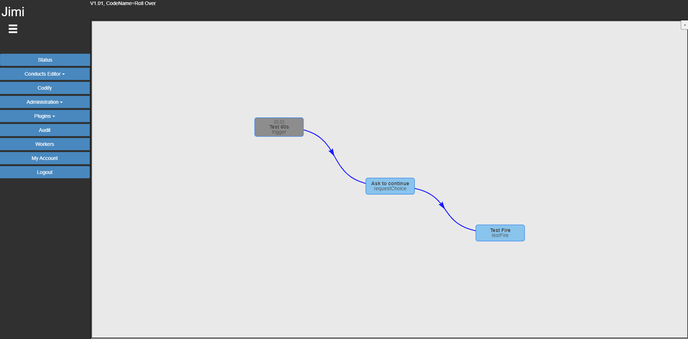
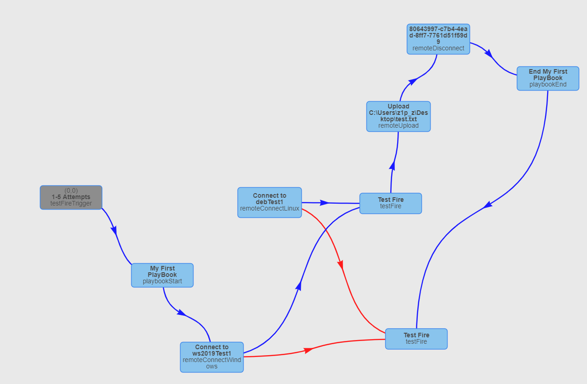

```
           8 8888            8 8888                    ,8.       ,8.                     8 8888
           8 8888            8 8888                   ,888.     ,888.                    8 8888
           8 8888            8 8888                  .`8888.   .`8888.                   8 8888
           8 8888            8 8888                 ,8.`8888. ,8.`8888.                  8 8888
           8 8888            8 8888                ,8'8.`8888,8^8.`8888.                 8 8888
           8 8888            8 8888               ,8' `8.`8888' `8.`8888.                8 8888
88.        8 8888            8 8888              ,8'   `8.`88'   `8.`8888.               8 8888
`88.       8 888'            8 8888             ,8'     `8.`'     `8.`8888.              8 8888
  `88o.    8 88'             8 8888            ,8'       `8        `8.`8888.             8 8888
    `Y888888 '               8 8888           ,8'         `         `8.`8888.            8 8888
```

A python based automation and scheduler platform, but can be used to acheive a number of things:
* Security incident detection by polling event management solutions
* IT ticket automation, open, close and update tickets
* Automated incident response across IT and security
* Network and vulnerability scanning
* Reduce repetitive tasks
* Carry out remote tasks on servers
* Monitor for threshold and raise alarms

Highly customizable using loops, if logic, variables, in-build functions and easily expandable using plugins

Checkout the wiki for more details and installation instructions




